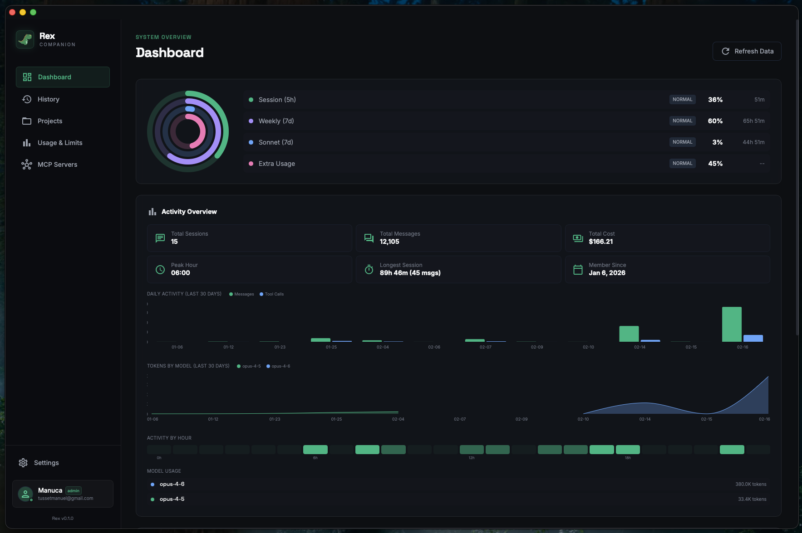
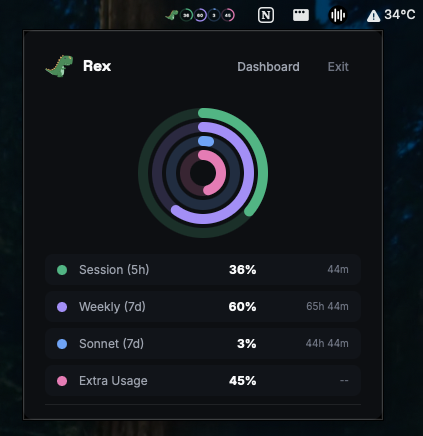

<p align="center">
  
</p>

<h1 align="center">Rex</h1>

<p align="center">
  <strong>Desktop companion for Claude Code CLI</strong>
</p>

<p align="center">
  Monitor API usage, manage sessions, and resume conversations — all from a native dashboard.
</p>

<p align="center">
  
  
  
  
  
  
</p>

<p align="center">
  
  
  
</p>

---

## Overview

Rex is a native desktop app that sits alongside your [Claude Code](https://docs.anthropic.com/en/docs/claude-code) workflow. It reads local session data, connects to the Anthropic OAuth API for usage metrics, and lets you resume any conversation in a terminal with one click.

<p align="center">
  
</p>

<p align="center">
  
</p>

---

## Features

| Feature | Description |
|---------|-------------|
| **Usage Monitoring** | Real-time activity rings for 5h session, 7d rolling, Sonnet, Opus, and extra usage limits with color-coded thresholds |
| **Activity Overview** | Daily activity chart (messages + tool calls), tokens by model over time, hourly heatmap, model cost breakdown |
| **Account Info** | Displays account name, email, organization, billing type, and role from Claude OAuth |
| **Project Stats** | Per-project cost, tokens, lines changed, duration, cache usage, model breakdown, and GitHub repo links |
| **MCP Status** | Monitors configured MCP servers (stdio/http/sse) with health checks and notifications on failure |
| **Tray Popup** | Quick-access popup from the system tray with compact activity rings and one-click dashboard access |
| **Session Management** | Browse, search, and filter local Claude Code sessions with project context and message counts |
| **One-Click Resume** | Resume any session directly in a native terminal window |
| **Smart Notifications** | Desktop alerts when usage crosses 80%, 90%, or 100% thresholds and when MCP servers go down |
| **Auto-Authentication** | Detects OAuth tokens from credentials file, macOS Keychain, or environment variables with automatic refresh on expiration |
| **Theme Support** | Light, dark, and system-follow modes with full theme across dashboard and tray popup |
| **Cross-Platform** | Native traffic lights on macOS, custom titlebar on Linux/Windows, WSL support |

---

## Tech Stack

<table>
  <tr>
    <td align="center" width="96"><br><sub>Tauri 2</sub></td>
    <td align="center" width="96"><br><sub>Rust</sub></td>
    <td align="center" width="96"><br><sub>React 19</sub></td>
    <td align="center" width="96"><br><sub>TypeScript</sub></td>
    <td align="center" width="96"><br><sub>Tailwind 4</sub></td>
    <td align="center" width="96"><br><sub>Vite 6</sub></td>
  </tr>
</table>

**State:** Zustand 5 &nbsp;|&nbsp; **Routing:** React Router 7 &nbsp;|&nbsp; **Charts:** Recharts 3 &nbsp;|&nbsp; **API:** Anthropic OAuth &nbsp;|&nbsp; **Fonts:** Inter, Space Grotesk

### Rust Crates

| Crate | Purpose |
|-------|---------|
| `reqwest` | HTTP client (rustls-tls) |
| `tokio` | Async runtime (fs, process) |
| `serde` / `serde_json` | Serialization |
| `chrono` | Date/time handling |
| `dirs` | Home directory resolution |
| `tauri-plugin-store` | Persistent key-value storage |
| `tauri-plugin-shell` | Shell command execution |
| `tauri-plugin-dialog` | Native OS file dialogs |
| `tauri-plugin-notification` | Desktop notifications |
| `tauri-plugin-positioner` | Tray popup positioning |
| `objc2-app-kit` | macOS NSWindow customization |

---

## Architecture

```
src-tauri/                      Rust backend (Tauri v2)
  src/
    commands/                   Tauri IPC command handlers
      account.rs                  Account info from ~/.claude.json
      auth.rs                     OAuth token detection
      mcp.rs                      MCP server listing
      platform.rs                 OS/platform info
      sessions.rs                 Session listing and reading
      stats.rs                    Project metrics and global stats
      terminal.rs                 Terminal launch for resume
      tray.rs                     System tray tooltip and icon
      usage.rs                    API usage fetching
    models/                     Data structures
      account.rs                  OAuth account info types
      mcp.rs                      MCP server config and status types
      session.rs                  Session metadata types
      stats.rs                    Project metrics, global stats, daily activity
      usage.rs                    Usage response types (5h, 7d, Sonnet, Opus, Extra)
    services/                   Core business logic
      account_reader.rs           Reads oauthAccount from ~/.claude.json
      anthropic_client.rs         Anthropic API client (OAuth)
      credentials.rs              Token auto-detection (file, keychain, env)
      mcp_checker.rs              MCP server config reading and health checks
      session_parser.rs           JSONL session file parser
      stats_reader.rs             Project stats and global stats from local files
      terminal_launcher.rs        Cross-platform terminal spawning
      wsl.rs                      WSL integration for Windows
    lib.rs                      App entry, window/tray creation, macOS NSWindow config

src/                            React frontend
  components/
    connection/                 Auth flow (ConnectionForm, DirectoryPicker)
    dashboard/                  Dashboard widgets (SessionList, StatsOverview)
    layout/                     App shell (Sidebar, TitleBar, AppLayout)
    ui/                         Reusable primitives (Card, Button, Badge, ActivityRings, etc.)
  hooks/
    useAutoRefresh.ts             Periodic data refresh based on settings
    useTheme.ts                   Light/dark/system theme management
    usePlatform.ts                OS and WSL detection
  pages/
    DashboardPage.tsx             Activity rings, stats overview, MCP widget, sessions
    UsagePage.tsx                 Detailed rate limit view with all 5 windows
    HistoryPage.tsx               Full session history with search
    ProjectsPage.tsx              Projects with cost, tokens, lines, model breakdown
    McpStatusPage.tsx             MCP server status with health indicators
    SettingsPage.tsx              App config with full account/billing details
    ConnectionPage.tsx            Initial auth setup
    TrayPage.tsx                  Compact tray popup with activity rings
  stores/                       Zustand state management
    useUsageStore.ts              Usage data with auto token refresh on 401
    useConnectionStore.ts         Auth credentials and token management
    useSessionStore.ts            Session listing and resume
    useAccountStore.ts            Account info (name, email, org, billing)
    useStatsStore.ts              Project metrics and global stats
    useMcpStore.ts                MCP server status with change detection
    useSettingsStore.ts           Theme, refresh interval, notifications
  services/
    api.ts                        Tauri invoke wrappers
    store.ts                      Persistent storage helpers
    notifications.ts              Usage threshold and MCP failure notifications
    trayIcon.ts                   Dynamic tray icon rendering (Canvas -> RGBA)
```

---

## Prerequisites

- [Rust](https://rustup.rs/) (stable)
- [Node.js](https://nodejs.org/) >= 18
- [Claude Code CLI](https://docs.anthropic.com/en/docs/claude-code) authenticated (`claude` command available)

**Platform-specific:**

| Platform | Requirements |
|----------|-------------|
| macOS | Xcode Command Line Tools |
| Linux | `libwebkit2gtk-4.1-dev`, `libappindicator3-dev`, `librsvg2-dev`, `patchelf` |
| Windows | WebView2 (bundled with Win 10+), optional WSL for Linux session support |

---

## Getting Started

```bash
# Clone
git clone <repo-url> && cd Rex

# Install frontend dependencies
npm install

# Development (opens Tauri window with hot reload)
npm run tauri dev

# Production build
npm run tauri build
```

The built app will be in `src-tauri/target/release/bundle/`.

---

## Authentication

### Automatic (recommended)

Rex auto-detects your OAuth token on first launch from:

1. `CLAUDE_CODE_OAUTH_TOKEN` environment variable
2. `~/.claude/.credentials.json` (written by `claude` CLI on login)
3. macOS Keychain (`Claude Code-credentials` entry)

When a token expires (401), Rex automatically re-detects from the file system (Claude CLI may have refreshed it). If the token is still invalid, it disconnects and redirects to the connection page.

### Manual fallback

If auto-detection fails, you can connect manually with your **Organization ID** and **Session Key**:

1. Open [console.anthropic.com](https://console.anthropic.com) in your browser
2. Navigate to **Settings > Usage**
3. Open browser **DevTools** (F12) > **Network** tab
4. Locate any request to the Anthropic API:
   - **Organization ID** — found in the **Request URL** (e.g. `.../api/organizations/<ORG_ID>/...`)
   - **Session Key** — found in the **`Set-Cookie` response header** (value of the `sessionKey` cookie)

> Credentials are stored locally via `tauri-plugin-store` and never leave your machine.

---

## Usage Monitoring

Rex tracks up to five Anthropic rate limits via concentric activity rings:

| Limit | Color | Description |
|-------|-------|-------------|
| **Session (5h)** | Green | 5-hour sliding window session limit |
| **Weekly (7d)** | Purple | 7-day rolling aggregate limit |
| **Sonnet (7d)** | Blue | 7-day Sonnet model-specific limit |
| **Opus (7d)** | Orange | 7-day Opus model-specific limit |
| **Extra Usage** | Pink | Extra usage allocation (if enabled) |

Rings change color at thresholds:
- **< 80%** — Accent color
- **>= 80%** — Yellow (warning)
- **>= 90%** — Red (critical)

Desktop notifications fire once per threshold (80%, 90%, 100%) and suppress duplicates on app startup.

---

## Session Resume

Clicking **Resume** on any session opens a native terminal running `claude --resume <session-id>`:

| OS | Method |
|----|--------|
| **macOS** | Writes a temp `.command` script, opens via `open` (Terminal.app) |
| **Linux** | Tries `x-terminal-emulator`, `gnome-terminal`, `konsole`, `xfce4-terminal`, `xterm` |
| **Windows** | `wt.exe` (Windows Terminal) or `cmd.exe`; WSL mode available |

---

## License

MIT
